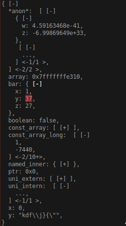

# unsegen_jsonviewer

[](https://crates.io/crates/unsegen_jsonviewer/)
[](https://docs.rs/unsegen_jsonviewer/)
[]()

`unsegen_jsonviewer` provides a jsonviewer widget for [unsegen](https://crates.io/crates/unsegen) for visualizing and interacting with structured, but dynamic data.
At the moment it only supports [`json`](https://crates.io/crates/json) values.

## Getting Started

`unsegen_jsonviewer` is [available on crates.io](https://crates.io/crates/unsegen_jsonviewer). You can install it by adding this line to your `Cargo.toml`:

```toml
unsegen_jsonviewer = "0.1.1"
```

## Screenshots



## Examples

There is an example at the root of the crate [documentation](https://docs.rs/unsegen_jsonviewer) which should be sufficient to get you going.

For a fully fledged application using `unsegen_jsonviewer`, you can have a look at [ugdb](https://github.com/ftilde/ugdb), which was developed alongside `unsegen` and the primary motivation for it.

## Licensing

`unsegen_jsonviewer` is released under the MIT license.
